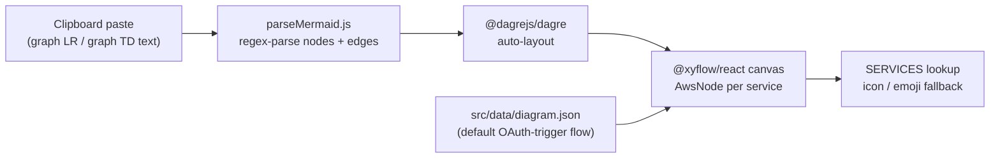

<div align="center">

# System Design

Interactive AWS / distributed-system architecture diagrams - paste a Mermaid flowchart, watch it auto-layout on a React Flow canvas with real service icons.

[](https://system-design-bheng.vercel.app)


[](LICENSE)

</div>

## Features

- **Paste-to-render Mermaid** - copy a `graph LR` / `graph TD` flowchart anywhere on the page (no input box needed, a global `paste` listener catches it) and it re-renders instantly.
- **Auto-layout** - `@dagrejs/dagre` computes node positions left-to-right so pasted diagrams never need manual arranging.
- **Named service icons** - a `SERVICES` lookup table maps ~50 AWS and common infra IDs (API Gateway, Lambda, DynamoDB, Kafka, Redis, Grafana, and more) to real icon assets, with a 5-tier fallback (exact id -> label match -> keyword match -> emoji) so unknown nodes still render a labeled box instead of breaking.
- **Default architecture preloaded** - `src/data/diagram.json` ships a real OAuth-trigger flow (user -> API Gateway -> Lambda -> KMS/DynamoDB -> Step Functions -> CloudWatch/CloudTrail) so the canvas isn't empty on first load.
- **Confetti + toast feedback** - a successful render fires `canvas-confetti` and a toast showing the node/edge count; a bad paste shows a "could not parse" toast instead of failing silently.
- **Pan/zoom canvas** - React Flow controls with fit-view-on-render, scroll-to-zoom, and drag-to-pan; nodes are read-only (not draggable) so pasted diagrams stay exactly as laid out.

## How it works



`parseMermaid.js` regex-matches `id[Label] -->|edge label| id[Label]` lines into a node/edge list, then hands them to Dagre for layout before React Flow renders each node through a shared `AwsNode` component that resolves the right icon from the `SERVICES` map.

The repo also carries a Vite dev proxy (`/jira` -> Atlassian, Basic auth in `vite.config.js`) and a ticket-board component (`src/QTMDashboard.jsx`) that queries it - present in the codebase but not currently mounted in `main.jsx`.

## Tech stack

| Layer | Technology |
|-------|-----------|
| Bundler | Vite 8 (ES modules) |
| UI | React 19, plain CSS |
| Language | JavaScript (JSX), ESLint 9 |
| Graph canvas | `@xyflow/react` (React Flow) |
| Layout engine | `@dagrejs/dagre` |
| Feedback | `canvas-confetti` |
| Data source | Static `src/data/diagram.json` (no database) |
| Deploy | Vercel |

## Getting started

```bash
git clone https://github.com/bunlongheng/system-design.git
cd system-design
npm install

npm run dev       # start the Vite dev server
npm run build     # production build
npm run preview   # preview the production build
npm run lint      # ESLint
```

Paste any `graph LR` or `graph TD` Mermaid text into the page to render it - no build step or config required.

## License

[MIT](LICENSE) (c) Bunlong Heng
