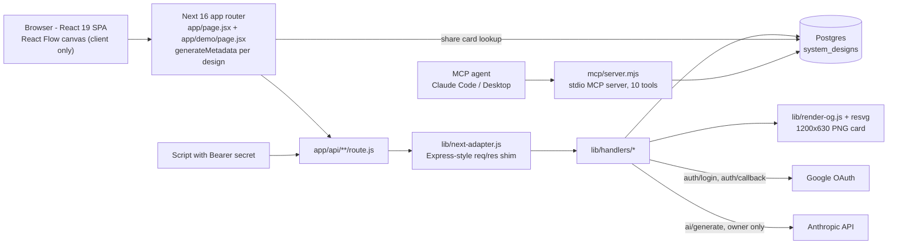

<div align="center">
  
  <h1>System Design</h1>
  <p><em>Interactive AWS/GCP architecture diagrams with a public artifact API and an MCP server</em></p>
  <p><a href="https://system-design-bheng.vercel.app">Live</a> &middot; <a href="https://github.com/bunlongheng/system-design">Repo</a> &middot; <a href="https://bunlongheng.com/projects?name=system-design">Portfolio</a></p>
  
</div>


## What it is

A Next.js 16 app that renders interactive AWS and GCP system-design diagrams on a React Flow canvas, with dagre auto-layout, per-node notes, numbered steps, and a share card for every public diagram. Diagrams live in 1 Postgres table and can be created 3 ways: by hand in the browser, through a Bearer-gated render-only HTTP API, or from any MCP agent via the bundled MCP server. AI generation (prompt to diagram) exists but is owner-only.

## Features

- **Canvas editing** - React Flow canvas with Fit, Arrange (dagre, left-to-right, step-ordered), Undo/Redo (Cmd+Z / Cmd+Shift+Z) covering drags and Arrange, and snap-align: hold Cmd, Ctrl or Shift while dragging to snap a node onto a neighbour's line with a yellow guide. Owner drags are saved through `PATCH { nodes }`. On a phone (viewport 640px or narrower) Fit frames the start node and its first hops at a readable zoom instead of the whole graph (`src/fitOptions.js`).
- **Steps** - every edge becomes a numbered step badge; badge style cycles Silver / Color / Dark / Plain; a badge slides along its own edge (`labelT`, 0.12..0.88), persists, and double-click resets it. A Details panel shows the pattern, description, and step list.
- **Per-node notes** - a plain-text note (max 400 chars) under any node. Owner edits inline (`PATCH { notes }`), and the note renders in the app, on shared links, in the SVG export and on the OG card.
- **Panel memory** - which panels (Steps, Details, Share, Code) and badge style were open is stored per diagram in `view_state` and restored on reopen. Visitors on a shared link never get panels.
- **Sharing + cards** - the Share panel previews the real 1200x630 card, copies the `/demo?name=<slug>` link, and offers PNG (html-to-image), JSON, and code exports plus the Web Share API. Opening Share publishes the diagram.
- **Public / Private** - a pill on every owned diagram toggles `is_public`. Private diagrams 404 for anyone else and preview as the generic site card.
- **Gallery** - My Diagrams / Demos tabs, title search, and an All / Work / Personal scope over your own diagrams (matches a `work` or `personal` entry in the row's `tags[]` - nothing in the app writes those tags, they are set on the row). Private cards carry a badge. `/demo` is a curated 12-slug public roster ordered by difficulty.
- **Trash** - Delete in the app or `DELETE /api/system-designs/:id` is a soft delete (`deleted_at`). Restore and list-trash exist only through MCP; permanent purge is `?purge=1` or the MCP `purge_system_design` tool, and only for a row already in trash.
- **Paste Mermaid** - paste a `graph LR` / `graph TD` block anywhere on the page and it renders as a diagram. An Import Formats modal copies ready-to-use templates.
- **Bring your own logo** - a node is either a catalog service key or carries an `icon` (https URL, `data:image/...` URI, or a same-origin image path like `/brand/foo.svg`). Remote icons are fetched once and inlined. 1 validation policy (`lib/validate-design.js`) is shared by the API, the MCP server and AI generate: nodes with no resolvable logo are rejected, `color` must be a 6-digit hex, and the size caps hold everywhere.
- **AI generate (owner only)** - prompt to diagram via `POST /api/ai/generate`. Gated to the signed-in owner; the public Bearer key is rejected so nobody else can spend Anthropic credits. The model's output passes the same logo gate and is arranged like an API create.
- **MCP server** - 10 tools for any MCP agent (create, read, update, soft delete, restore, purge, list trash, list services, schema). See [mcp/README.md](./mcp/README.md).
- **Public API** - `POST /api/ai/system-designs` renders a finished `{ nodes, edges }` structure into a saved diagram and returns its URLs. No model call.
- **Security** - per-request CSP nonce in `middleware.js` (no `unsafe-inline`, no `unsafe-eval` in prod), HSTS / X-Frame-Options / nosniff headers in `next.config.mjs`, constant-time Bearer compare, HMAC-signed owner session cookie, per-instance rate limits on every route.

## Architecture



The canvas is rendered client-side only (`app/AppClient.jsx` uses `next/dynamic` with `ssr: false`). The share card title, description and image are produced server-side by `generateMetadata` in `app/share-metadata.js`. Every API route is a 1-line wrapper: `toRoute(withErrors(handler))`, so the 12 handlers keep their Express-style `(req, res)` shape and their unit tests. The MCP server bypasses HTTP and uses the same `lib/` layer against the same database.

## Project structure

```
system-design/
  app/
    layout.jsx              # Static head, manifest, icons, default OG tags
    page.jsx                # "/" - gallery + canvas, generateMetadata
    demo/page.jsx           # "/demo" - public showcase, generateMetadata
    AppClient.jsx           # next/dynamic(ssr:false) wrapper around src/App.jsx
    share-metadata.js       # Per-design OG/Twitter tags for ?name= or ?id=
    api/
      ai/generate/route.js            # POST, owner only, Claude
      ai/system-designs/route.js      # POST, Bearer, render-only create
      auth/{login,callback,me,logout}/route.js
      health/route.js
      og/route.js                     # GET PNG card
      system-designs/route.js         # GET owner list
      system-designs/public/route.js  # GET curated demo roster
      system-designs/[id]/route.js    # GET / PATCH / DELETE
  lib/
    next-adapter.js         # toRoute(): Request -> (req, res) shim
    wrap.js                 # withErrors()
    env.js                  # Fails a production build on missing env / LOCAL_DEV
    db.js                   # pg Pool (max 3)
    auth-owner.js           # bearerOk(), authorizeOwner(), ownerId()
    auth-session.js         # HMAC session cookie sign/verify, SESSION_MIN_IAT
    is-local.js             # Loopback/LAN dev bypass, off in prod
    rate-limit.js           # Per-instance fixed-window limiter
    slugs.js                # Unique slug per owner
    validate-design.js      # 1 policy for API, MCP and AI generate: logo gate, icon/color rules, caps
    resolve-icon.js         # Inline remote https icons as data: URIs
    arrange.js              # arrangeNew(): born-arranged layout
    render-svg.js           # Diagram -> self-contained SVG
    render-og.js            # Diagram -> 1200x630 card SVG
    icon-data.js            # Generated: icon manifest (prebuild)
    font-data.js            # Generated: Roboto bytes (prebuild)
    fonts/                  # Roboto-Regular.ttf, Roboto-Bold.ttf
    title-base.js           # Version-suffix stripping for duplicate warnings
    handlers/
      create-system-design.js
      system-design-by-id.js
      list-system-designs.js
      list-public-system-designs.js   # DEMO_SLUGS
      generate.js
      og-image.js
      health.js
      auth-login.js / auth-callback.js / auth-me.js / auth-logout.js
  src/
    App.jsx                 # State, gallery/detail switch, undo/redo, snap, share, exports
    services.js             # Service catalog (id -> label, sub, icon)
    brands.js
    layout.js               # dagre layout + start marker
    snapAlign.js            # Cmd/Ctrl/Shift drag snapping
    fitOptions.js           # Phone fit: centre on the start node at a readable zoom
    parseMermaid.js         # Mermaid -> nodes/edges
    note.js                 # cleanNote() (400 char cap)
    difficulty.js / timeAgo.js / usePullToRefresh.js
    index.css
    data/diagram.json       # Seed diagram
    components/
      AwsNode.jsx, GradientEdge.jsx, SnapGuides.jsx, DiagramMinimap.jsx
      DiagramCard.jsx, ImportFormatsModal.jsx, AIThinkingOverlay.jsx
      SignInScreen.jsx, Footer.jsx, Toast.jsx, noteEditContext.js
    views/
      IndexView.jsx         # Gallery: tabs, search, Work/Personal scope
      DetailView.jsx        # Canvas toolbar, panels, share, delete modal
  mcp/
    server.mjs              # MCP server (stdio), 10 tools
    load-env.mjs            # Loads the repo .env by absolute path
    README.md
  db/
    migrate.mjs             # Applies db/migrations/*.sql, tracked in system_designs_migrations
    migrations/             # 7 SQL files: table, is_public, description, pattern, difficulty, trash, view_state
  tests/
    unit/                   # 38 Vitest files (handlers, auth, validation, layout, views)
    e2e/                    # 7 Playwright specs (api, share, render, snap, arrange-undo, share-ui, panel-memory)
  scripts/
    gen-icon-manifest.mjs   # -> lib/icon-data.js (prebuild)
    gen-font-data.mjs       # -> lib/font-data.js (prebuild)
    gen-icons.mjs           # favicon + og.png from icon-512.png (dev only)
  public/                   # icons/, brand/, og.png, manifest.json, favicons
  middleware.js             # Per-request CSP nonce
  next.config.mjs           # Security headers, serverExternalPackages, imports lib/env.js
  vercel.json               # Build command (migrate on production) + skip rule
  playwright.config.js / vitest.config.js / eslint.config.js
  .mcp.json                 # Claude Code MCP wiring
```

## Getting started

Requires Node 22 and a Postgres database.

```bash
git clone https://github.com/bunlongheng/system-design.git
cd system-design
npm install
cp .env.example .env    # fill in the variables below
npm run migrate         # applies db/migrations/*.sql
npm run dev             # http://localhost:5174
```

`npm run dev` serves the UI and the API from 1 Next process. `npm run build` first runs `prebuild`, which regenerates `lib/icon-data.js` and `lib/font-data.js`.

```bash
npm run lint       # eslint .
npm test           # Vitest unit tests (tests/unit)
npm run test:e2e   # Playwright: builds, starts next on :4399, runs tests/e2e
```

The e2e specs sign an owner cookie and call the API with the real secret, so they need the `.env` values in the shell, not just in the file:

```bash
set -a; source .env; set +a
npm run test:e2e
```

Other scripts: `npm run start` (production server on :5174), `npm run mcp` (MCP server on stdio), `npm run gen:icons` (icon manifest only).

## Environment variables

`lib/env.js` runs on import from `next.config.mjs`. On a production build (`VERCEL_ENV=production`) it throws if any required variable is missing or if `LOCAL_DEV=true`, so a misconfigured deploy fails instead of shipping a dead API. Preview deploys, CI and local dev are not checked.

| Variable | Required in prod | Used by |
|----------|------------------|---------|
| `SYSTEM_DESIGNS_API_SECRET` | Yes | Bearer for `POST /api/ai/system-designs` and `GET /api/system-designs`. Server-only. |
| `SYSTEM_DESIGNS_API_SECRET_PARTNER` | No | Second, revocable Bearer accepted everywhere the main one is. |
| `DATABASE_URL` | Yes | `pg` Pool, migrations, MCP server. |
| `DATABASE_SSL` | No | `"true"` enables TLS with `rejectUnauthorized: false` (self-signed remote). |
| `OWNER_USER_ID` | Yes | `user_id` on every row; all reads/writes are scoped to it. |
| `SYSTEM_DESIGNS_APP_URL` | No | Base for returned `url` / `share_url` / `svg_url` and `metadataBase`. Defaults to the prod URL. |
| `GOOGLE_CLIENT_ID` / `GOOGLE_CLIENT_SECRET` | Yes | Google OAuth for owner sign-in. Redirect URI: `<APP_URL>/api/auth/callback`. |
| `AUTH_SECRET` | Yes | HMAC key for the `sd_session` cookie (`openssl rand -hex 32`). 7-day sessions. |
| `OWNER_EMAIL` | Yes | The only Google account that gets a session. |
| `SESSION_MIN_IAT` | No | Unix timestamp; any session issued before it is rejected. Revokes all sessions without a store. |
| `ANTHROPIC_API_KEY` | No | Only `POST /api/ai/generate` (owner only). Unset means generate fails, nothing else does. |
| `LOCAL_DEV` | No, must be unset | Lets `isLocal()` treat loopback/LAN as the owner under `NODE_ENV=production`. Build fails if `true` in prod. |

`VERCEL_ENV` is set by Vercel and gates both the env check and the build-time migration. `PORT` overrides the Playwright server port (default 4399).

## Public API

All routes run on the Node runtime, `force-dynamic`. HEAD is accepted wherever GET is. Rate limits are per warm instance, fixed window, and answer `429` with `Retry-After`.

| Route | Auth | Notes |
|-------|------|-------|
| `POST /api/ai/system-designs` | Bearer | Render-only create. 60/min. |
| `GET /api/system-designs/:idOrSlug` | Public | JSON, or SVG with `?format=svg`. Private rows 404 for non-owners. 180/min. |
| `GET /api/system-designs/public` | Public | The curated `DEMO_SLUGS` roster (12), public + not deleted, by difficulty. 120/min. |
| `GET /api/system-designs` | Owner (session, Bearer, or local dev) | Owner's diagrams minus the demo roster, newest first, max 60. 120/min. |
| `PATCH /api/system-designs/:id` | Owner session only (Bearer rejected) | 1 of 5 body shapes, uuid only. |
| `DELETE /api/system-designs/:id` | Owner session only (Bearer rejected) | Soft delete; `?purge=1` destroys a trashed row. uuid only. |
| `GET /api/og?name=<slug>` or `?id=<uuid>` | Public | 1200x630 PNG for a public design, else `302 /og.png` with `no-store`. 120/min. |
| `POST /api/ai/generate` | Owner session or local dev only | Prompt (max 2000 chars) to Claude, saved private, tags `["AI"]`. `422` if the model's output fails the logo gate. 10/min. |
| `GET /api/auth/login` | Public | Redirects to Google (20/min). `GET /api/auth/callback` verifies `OWNER_EMAIL` and sets `sd_session`. |
| `GET /api/auth/me` | Public | `{ authenticated, email? }`. `POST /api/auth/logout` clears the cookie. |
| `GET /api/health` | Public | `200 { ok:true, checks }` or `503`. Checks secret, owner id, Google creds, auth secret, owner email, DB. |

### Create

```bash
curl -X POST https://system-design-bheng.vercel.app/api/ai/system-designs \
  -H "Authorization: Bearer $SYSTEM_DESIGNS_API_SECRET" \
  -H "Content-Type: application/json" \
  -d '{
    "title": "Netflix System Design",
    "is_public": true,
    "nodes": [
      { "id": "user",       "position": { "x": 40,  "y": 200 } },
      { "id": "cloudfront", "position": { "x": 260, "y": 200 }, "note": "Edge cache. A hit never reaches the API." },
      { "id": "apigw",      "position": { "x": 480, "y": 200 } },
      { "id": "lambda",     "position": { "x": 700, "y": 200 } },
      { "id": "dynamo",     "position": { "x": 920, "y": 200 } }
    ],
    "edges": [
      { "id": "e1", "source": "user",       "target": "cloudfront", "label": "HTTPS", "animated": true },
      { "id": "e2", "source": "cloudfront", "target": "apigw",      "label": "origin" },
      { "id": "e3", "source": "apigw",      "target": "lambda",     "label": "invoke" },
      { "id": "e4", "source": "lambda",     "target": "dynamo",     "label": "read/write" }
    ]
  }'
```

Body fields:

| Field | Notes |
|-------|-------|
| `title` | Required string, max 200 chars. |
| `type` | Optional, only `"system-design"` is accepted. |
| `nodes[]` | Required, 1 to 100. Each `{ id, position?, icon?, label?, sub?, color?, note? }`. `id` is a catalog service key unless `icon` is given. `color` is a 6-digit hex or it is dropped. `note` is plain text, max 400 chars. Positions are optional; missing ones are laid out. |
| `edges[]` | Optional, max 300. Each `{ id?, source, target, label?, animated? }`. |
| `pattern` | Optional string, max 200. The one-line "what it tests" shown above the diagram and on the share card. |
| `description` | Optional string, max 600. The goal paragraph under it. |
| `is_public` | Optional boolean, default `false`. `true` makes the link open for anyone and gives it a real card. |
| `return` / `format` | `"svg"` (or `?format=svg` on the URL) adds the rendered `svg` to the response. |

Rules:

- **Logo gate** (`lib/validate-design.js`, shared with MCP and AI generate) - every node must resolve to a real logo: a known service key, or a custom `icon` that is an `https://` URL, a `data:image/(png|jpeg|svg+xml|webp|gif)` URI with a real `;base64,` or `,` boundary, or a same-origin image path (`/brand/foo.svg`, never protocol-relative `//host`). Otherwise `400` with `unresolved: [ids]`.
- Remote `https` icons are fetched once (https only, no redirects, `image/*`, max 24KB, 5s, private hosts blocked, raster icons must be at least 96px) and inlined as `data:` URIs. A fetch that fails is `400` with `icon_fetch_failed`.
- Inline `data:` icons are capped at 24KB.
- Any `400` carries `error`, `required_fields` (including `nodes[].note` and `is_public`), and a full `sample_request`.
- A bad or missing Bearer is `401`. `SYSTEM_DESIGNS_API_SECRET_PARTNER`, when set, is accepted as well.
- Rows are tagged `["API"]`.

Response `201`:

```json
{
  "id": "<uuid>",
  "url": "https://system-design-bheng.vercel.app/?id=<uuid>",
  "share_url": "https://system-design-bheng.vercel.app/demo?name=<slug>",
  "visibility": "public",
  "svg_url": "https://system-design-bheng.vercel.app/api/system-designs/<uuid>?format=svg"
}
```

A private create adds `share_note` explaining that recipients get a 404 until it is published.

### Read

`GET /api/system-designs/:idOrSlug` accepts the uuid or the slug. It returns `id, title, slug, nodes, edges, type, tags, is_public, description, pattern, difficulty, view_state, created_at`. A row with `is_public === false` returns `404` unless the request is the owner, so private ids cannot be probed. `?format=svg`, `?svg=1`, or an `Accept: image/svg+xml` header returns a self-contained SVG (`Cache-Control: public, max-age=60`).

### Update (owner session only)

`PATCH /api/system-designs/:id` takes exactly 1 of these bodies:

| Body | Effect |
|------|--------|
| `{ "nodes": [{ id, position }] }` | Merges positions by id into the stored nodes; branding is never taken from the request. A node not yet stored is added whole. Returns `{ id, saved }`. |
| `{ "notes": [{ id, note }] }` | Sets or clears (empty string) the note per node. Returns `{ id, noted }`. |
| `{ "edges": [{ id, labelT }] }` | Moves a step badge along its edge, clamped to 0.12..0.88. Returns `{ id, moved }`. |
| `{ "view_state": { panels, badge } }` | Panels from `steps, details, share, code`; badge from `dark, silver, color, plain`. Returns `{ id, view_state }`. |
| `{ "is_public": true|false }` | Publishes or hides. Returns `{ id, is_public }`. |

Anything else is `400`. Trashed rows are `404`.

### Delete (owner session only)

`DELETE /api/system-designs/:id` stamps `deleted_at` and returns `{ deleted, recoverable: true }`. The row leaves every list and every shared link but stays in the table. `DELETE /api/system-designs/:id?purge=1` permanently removes a row that is already in trash and returns `{ purged }`. There is no HTTP restore; use the MCP `restore_system_design` tool.

## Sharing

- `share_url` is `/demo?name=<slug>`. Both `/` and `/demo` run `generateMetadata` (`app/share-metadata.js`): given `?name=<slug>` or `?id=<uuid>` it looks up a public, non-deleted row and emits that design's title, description (pattern or description column) and an `og:image` of `/api/og?name=<slug>`. Slack, iMessage and similar unfurl with the diagram itself.
- `/api/og` renders the card server-side: `lib/render-og.js` builds an SVG (brand mark, title, pattern line, chips, diagram preview with notes), and `@resvg/resvg-js` rasterises it with the bundled Roboto fonts. Cached 1 hour.
- A private design gets no card and no title: `generateMetadata` returns the generic site tags and `/api/og` redirects to the static `/og.png` with `no-store`, so the instant it is published the next crawl gets the real card.
- Opening a private design's link as a visitor is a `404` from the API, and the page shows its not-found state.
- In the app, opening the Share panel on a private diagram publishes it first (`PATCH { is_public: true }`), then previews the card and copies the link. The Public / Private pill toggles it back at any time.
- `/demo` with no query is the public landing: the 12 curated `DEMO_SLUGS`, only while each is still public.

## MCP

`mcp/server.mjs` is a stdio MCP server that exposes 10 tools (`list_system_designs`, `get_system_design`, `create_system_design`, `update_system_design`, `delete_system_design`, `restore_system_design`, `purge_system_design`, `list_trash`, `list_services`, `get_diagram_schema`). It uses the same `lib/` layer against the same Postgres, so anything an agent creates is in the app immediately, and it applies the same logo gate plus a start-left layout rule. The repo's `.mcp.json` wires it into Claude Code automatically. Parameters, responses, defaults and Claude Desktop wiring are in [mcp/README.md](./mcp/README.md).

## Tests + CI

| Suite | Tool | What it covers |
|-------|------|----------------|
| `tests/unit` (38 files) | Vitest, node env, React Testing Library for views | Every handler, auth (Bearer, session, `SESSION_MIN_IAT`, is-local), env guard, rate limit, slugs, the shared design validator and the AI generate gate, layout and start-left rule, snap-align, Mermaid parser, SVG/OG renderers, share metadata, gallery and detail views. Coverage thresholds: lines 60, statements 60, branches 65, functions 35. |
| `tests/e2e` (7 specs) | Playwright | Project `api` (`api`, `share`): health, 401 on bad token, 400 with sample, generate rejects Bearer, create/read/delete round trip, OG tags and PNG for public vs private, soft delete. Project `browser` (`render`, `snap`, `arrange-undo`, `share-ui`, `panel-memory`): `/?id=` and `/?name=` render, phone opens at a readable zoom, Cmd+drag snap, undo/redo, Share publishes and yields a working link, badge slides along its edge, panel memory survives back-and-reopen. |

Playwright builds and starts a production `next start` on port 4399 (strict CSP, dev bypass off), so the specs exercise what ships.

`.github/workflows/ci.yml` runs on every PR and push to `main`: Postgres 16 service, Node 22, `npm ci`, throwaway secrets, `npm run lint`, `npm run test:coverage`, `npm run migrate`, Playwright Chromium install, `npm run test:e2e`.

`.github/workflows/prod-monitor.yml` runs every 15 minutes, on every push to `main`, and on demand: asserts `GET /api/health` is `200` with `ok:true`, then POSTs to `/api/ai/system-designs` with a bad token and requires `401` (proves the route is up and gated, never creates a row).

## Deploy

- Vercel, `framework: nextjs`. Every push to `main` deploys, except commits whose subject starts with `chore:`, `ci:`, `test:` or `docs:` (`ignoreCommand` in `vercel.json`).
- `buildCommand`: `node db/migrate.mjs` runs only when `VERCEL_ENV=production`, then `npm run build`. `migrate.mjs` skips cleanly when `DATABASE_URL` is unset (previews), and `lib/env.js` fails a production build that lacks a required variable or has `LOCAL_DEV=true`.
- `prebuild` bakes the icon manifest and Roboto bytes into JS modules, because a serverless function cannot read `public/` or system fonts at runtime. `@resvg/resvg-js` and `pg` are `serverExternalPackages`.
- The prod monitor above doubles as the post-deploy smoke test.

## License

MIT (c) Bunlong Heng - see [LICENSE](./LICENSE).

---

<p align="center">
  <sub>Built by <a href="https://bunlongheng.com">Bunlong Heng</a> &middot; <a href="https://bunlongheng.com/projects/system-design">See it in my portfolio &rarr;</a></sub>
</p>
