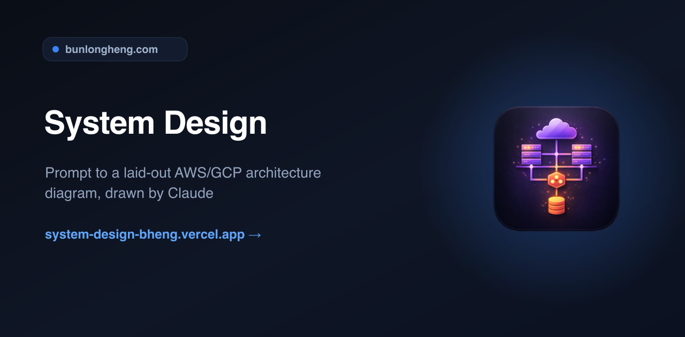
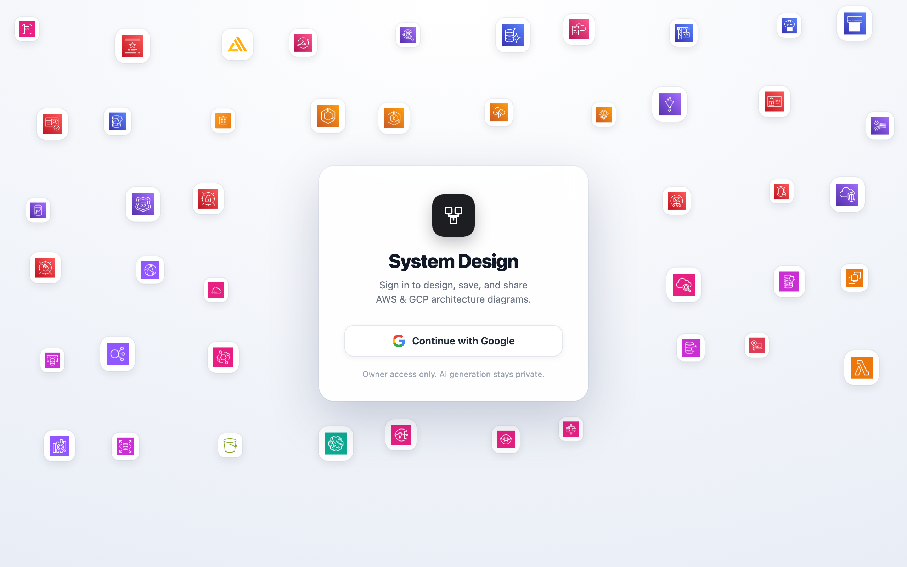
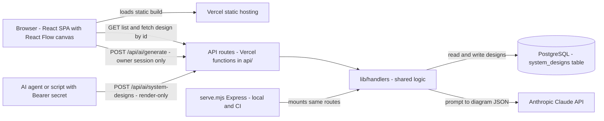

<div align="center">
  
  <h1>System Design</h1>
  <p><em>Prompt to a laid-out AWS/GCP architecture diagram, drawn by Claude</em></p>
  <p><a href="https://system-design-bheng.vercel.app">Live</a> &middot; <a href="https://github.com/bunlongheng/system-design">Repo</a> &middot; <a href="https://bunlongheng.com/projects?name=system-design">Portfolio</a></p>
  
</div>

---

<div align="center">

# System Design

<p align="center"></p>


Interactive AWS/GCP system design diagram tool with React Flow, dagre auto-layout, and an AI-callable artifact API for programmatic diagram creation.


</div>

## What it is

A Vite + React single-page app that renders interactive AWS and GCP system design diagrams using React Flow, with dagre handling automatic graph layout. Paste a Mermaid flowchart to render it, or drag components onto the canvas by hand. Beyond the SPA, the app exposes a small render-only HTTP API so diagrams can be created programmatically and shared as a link - backed by a shared PostgreSQL database and deployed as Vercel serverless functions.

## Tech Stack

| Layer | Technology |
|-------|-----------|
| Bundler | Vite 8 |
| UI | React 19 + React Flow (`@xyflow/react`) + dagre (`@dagrejs/dagre`) |
| Language | JavaScript (JSX) |
| API | Node + Express (local/CI), Vercel serverless functions (prod) |
| Database | PostgreSQL (`pg`) |
| AI | Anthropic SDK (admin-only diagram generation) |
| Hosting | Vercel |
| Tests | Vitest (unit) + Playwright (e2e) |
| Lint | ESLint |

## Architecture

## Architecture



*The React SPA and external Bearer-authenticated callers hit the same API routes, which funnel into shared lib/handlers backed by PostgreSQL - only the owner-gated generate route ever calls Claude.*


The browser SPA is a static build served by Vercel. Requests to `/api/*` hit Vercel serverless functions in `api/`, which are thin wrappers around the shared handlers in `lib/handlers/`. Those handlers talk to a PostgreSQL database (`system_designs` table). Locally and in CI, `serve.mjs` runs the exact same handlers behind Express so `npm run start` is a prod-like single process.

```
Browser (React SPA)
    |
    | static assets           /api/* requests
    v                             v
Vercel static hosting     Vercel serverless functions (api/)
                                   |
                                   v
                           lib/handlers/* (shared logic)
                                   |
                                   v
                              PostgreSQL (pg)

Local/CI equivalent: serve.mjs (Express) serves dist/ + mounts
the same lib/handlers/* on the same routes, listening on :4321.
```

## Features

- Interactive AWS and GCP system-architecture diagrams
- Paste-to-render: parse a Mermaid `graph LR`/`graph TD` diagram straight into the canvas
- Auto-layout via dagre
- Cmd/Ctrl + drag to snap a node onto the closest neighbour's edge or center line, with a yellow guide showing where it lands
- Library of AWS/GCP service icons (compute, storage, messaging, security, CI/CD, observability)
- A gallery that lists saved designs, with deep-linkable `/?id=` share URLs
- AI-callable artifact API for programmatic diagram creation

## AI-callable artifact API

There is exactly **one** publicly documented way to create a system design programmatically. It is **render-only**: the caller supplies the finished structure, the API persists it and returns its URL. It makes **no model call** and spends **zero Anthropic dollars**.

### `POST /api/ai/system-designs` (public, render-only)

```bash
curl -X POST https://system-design-bheng.vercel.app/api/ai/system-designs \
  -H "Authorization: Bearer $SYSTEM_DESIGNS_API_SECRET" \
  -H "Content-Type: application/json" \
  -d '{
    "title": "Netflix System Design",
    "type": "system-design",
    "nodes": [
      { "id": "user",       "position": { "x": 40,  "y": 200 } },
      { "id": "cloudfront", "position": { "x": 260, "y": 200 } },
      { "id": "apigw",      "position": { "x": 480, "y": 200 } },
      { "id": "lambda",     "position": { "x": 700, "y": 200 } },
      { "id": "dynamo",     "position": { "x": 920, "y": 200 } }
    ],
    "edges": [
      { "id": "e1", "source": "user",       "target": "cloudfront", "label": "HTTPS", "animated": true },
      { "id": "e2", "source": "cloudfront", "target": "apigw",      "label": "origin" },
      { "id": "e3", "source": "apigw",      "target": "lambda",     "label": "invoke" },
      { "id": "e4", "source": "lambda",     "target": "dynamo",     "label": "read/write" }
    ]
  }'
# -> 201 { "url": "https://system-design-bheng.vercel.app/?id=<uuid>" }
```

- **Auth:** `Bearer $SYSTEM_DESIGNS_API_SECRET` (constant-time compare). A bad/missing token returns `401`.
- **Body:** `title` (string, required), `nodes` (non-empty `[{ id, position }]`, required), `edges` (`[{ source, target, label?, animated? }]`), `type` (`"system-design"` only). Bad input returns `400` with a `sample_request`.
- Each node either uses a **known service key** (e.g. `cloudfront`, `lambda`, `dynamo`, `s3`, `sagemaker`, plus SaaS/tool brands like `hubspot`, `cyclr`, `fastapi`, `mailchimp`), **or brings its own icon** so any brand can appear:
  ```json
  { "id": "acme", "label": "Acme CRM", "sub": "CRM", "color": "#7c3aed",
    "icon": "https://cdn.example.com/acme.svg" }
  ```
  `icon` accepts a **remote https URL** (fetched once and inlined as a `data:` URI so the diagram stays self-contained), a `data:image/...` URI, or a same-origin `/path`. Remote fetches are guarded (https-only, no redirects, `image/*` only, <=24KB, 5s timeout).
- **Rate limit:** 60 requests/min per IP; excess returns `429` with a `Retry-After` header.

### Internal / admin-only (NOT public)

| Route | Access | Notes |
|-------|--------|-------|
| `POST /api/ai/generate` | Owner **only** | Prompt -> Claude. Requires the owner's Google sign-in session (or local dev). The Bearer key is **rejected** (`authorizeOwner(req,{allowBearer:false})`) so public callers can never spend Anthropic credits. |
| `GET /api/auth/login` / `callback` / `me`, `POST /api/auth/logout` | Public | Google OAuth (owner-only). Only `OWNER_EMAIL` gets a session; the session gates AI generation in the deployed app. |
| `GET /api/system-designs` | Public read | The owner's saved designs, newest first (max 60) - the gallery feed. |
| `GET /api/system-designs/:id` | Public read | Returns a saved design's JSON (what the returned URL renders). |
| `DELETE /api/system-designs/:id` | Bearer-gated | Removes an artifact. |
| `GET /api/health` | Public | `200`/`503` liveness for the prod monitor (API secret + owner + DB). |

## Project Structure

```
system-design/
  src/
    App.jsx            # Main app - gallery + detail canvas, diagram rendering
    services.js        # AWS/GCP service icon catalog + lookup helpers
    components/        # Extracted UI (ImportFormatsModal, ...)
    main.jsx           # React entry point
    parseMermaid.js    # Mermaid -> React Flow node/edge parser
    index.css          # Global styles
    data/diagram.json  # Default/sample diagram data
  api/                 # Vercel serverless functions (thin wrappers)
    health.js
    ai/system-designs.js
    ai/generate.js
    system-designs.js  # GET list
    system-designs/[id].js
  lib/
    db.js              # PostgreSQL client (pg)
    auth-owner.js      # Bearer + owner auth helpers
    auth-session.js    # Owner session cookie: HMAC sign/verify
    is-local.js        # Local/LAN detection for the dev bypass
    env.js             # Required-env validation (fails the prod build if missing)
    slugs.js           # Unique slug generation
    rate-limit.js      # In-memory per-instance rate limiter
    wrap.js            # Error-wrapping middleware
    handlers/          # Shared handler logic (imported by api/ and serve.mjs)
  db/
    migrate.mjs        # Migration runner
    migrations/        # SQL migrations
  serve.mjs            # Express server - local/CI prod-like API + static SPA
  tests/               # unit/ (Vitest) + e2e/ (Playwright)
  .github/workflows/   # CI + prod-monitor
```

## Getting Started

```bash
git clone https://github.com/bunlongheng/system-design.git
cd system-design
npm install
cp .env.example .env   # fill in the variables below
npm run migrate         # create the system_designs table
```

Local development (two processes):

```bash
npm run dev   # Vite dev server (SPA) on http://localhost:5173
npm run api   # Express API server on http://localhost:4321
```

Prod-like single process:

```bash
npm run build
npm run start   # serves dist/ + API together on http://localhost:4321
```

Tests:

```bash
npm test         # Vitest unit tests
npm run test:e2e # Playwright e2e tests (API + a browser render check)
```

## Environment Variables

| Variable | Description |
|----------|-------------|
| `SYSTEM_DESIGNS_API_SECRET` | Bearer secret for the public artifact API. Server-only; never `NEXT_PUBLIC_*`/`VITE_*`. |
| `DATABASE_URL` / `DATABASE_SSL` | Postgres connection for the `system_designs` table. |
| `OWNER_USER_ID` | UUID that owns API-created artifacts. |
| `SYSTEM_DESIGNS_APP_URL` | Base URL used to build the returned artifact URL. |
| `ANTHROPIC_API_KEY` | Admin-only, used by `POST /api/ai/generate`. |
| `GOOGLE_CLIENT_ID` / `GOOGLE_CLIENT_SECRET` | Google OAuth 2.0 web client for owner sign-in. |
| `AUTH_SECRET` | Signs the owner session cookie (`openssl rand -hex 32`). |
| `OWNER_EMAIL` | The single Google account allowed to sign in and use AI generation. |
| `LOCAL_DEV` | Dev-only auth bypass. Never set in production. |

## License

MIT (c) Bunlong Heng - see [LICENSE](./LICENSE).

---

Built by [Bunlong Heng](https://www.bunlongheng.com) | [GitHub](https://github.com/bunlongheng/system-design)

---

<p align="center">
  <sub>Built by <a href="https://bunlongheng.com">Bunlong Heng</a> &middot; <a href="https://bunlongheng.com/projects/system-design">See it in my portfolio &rarr;</a></sub>
</p>
